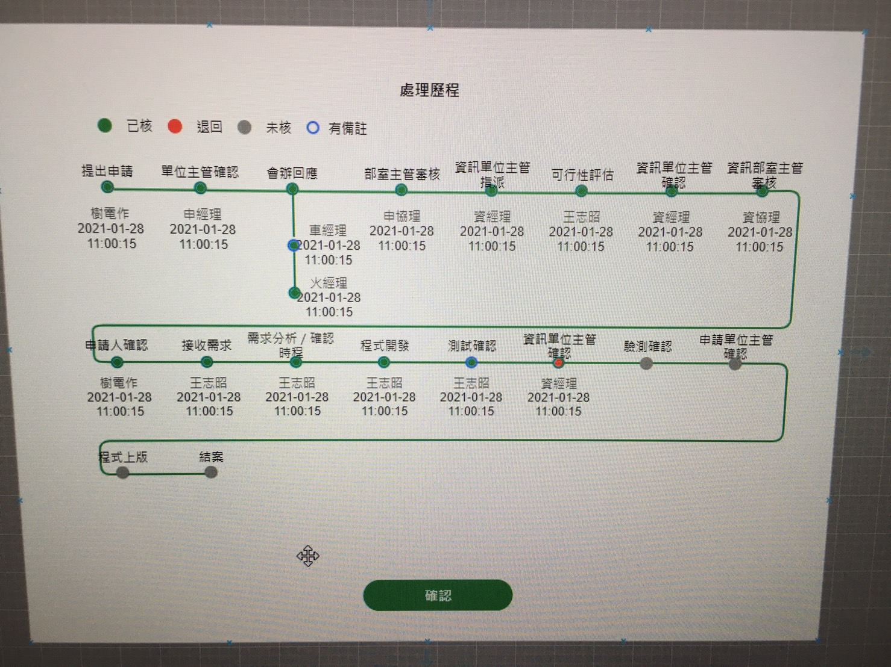

# ng_inputOutput 練習

## 情境

因專案需求，需要將一個共用元件 `last` 給其他頁面使用，
目前此功能只有單一頁面再使用，其裡面已經寫好固定邏輯，是用 D3 繪圖，故要從外部將資料傳到 `last`。
所以 SA 請我在此共用元件的外層再建立一個共用元件 `middle` 作為傳遞的元件，
此元件最重要的目的是要把所有的資料都傳到 `last` 的元件。

## 流程

1. 此情境是一個 `table` 並有個查詢按鈕。
2. 點擊查詢按鈕會帶入該筆資料的 `id`，並且呼叫一支 API，格式如 `db.json` 。
3. 最後的 last 已經將 Input 的變數寫好。
4. 但因此功能本來只給其中一頁使用，但 SA 希望把此功能做成共用元件給其他頁面使用。
5. 故要再外面再包一層共用元件 middle 將資料傳遞給 last。

### 條件

1. 共有兩個陣列，`data` 與 `list`，因為 D3 繪圖原因，需要把所有的 `data` 與 `list` 所有的內容都傳到 `last` 的元件中。
2. `data` 中的最後一筆 `children` 中的陣列的 `node` 陣列若為空字串，就停止跑迴圈並停止。

### 如下圖

## 問題

1. 單純 `input` 我會實作，但 `middle` 這個我目前的想法是把 `app` 中的資料 `@Input` 傳給 `middle`，然後再把接到的資料經過整理後，再 `@Output` 傳給 `last`，但我發射出去的，想請問的是在同個元件中可以同時使用 `@Input` 跟 `@Output` 嗎?

2. 我從 `app` 跑回圈一一把物件重新帶入 `middle` 陣列變數中，為什麼會反覆跑這麼多次迴圈?

3. 我嘗試用 `concat` 合併陣列，但這方法跟我想得不同，並無法合併...

4. 原想用一新的空陣列，再重新 push 到裡面，再把最後一筆陣列的條件寫好，再傳到 `last` 的元件。~~這邊是否要直接使用 `@Output` 方法~~，還是直接在下一層 `@Input` 就可以?

## Data 資料

使用 `db.json` 呈現。
